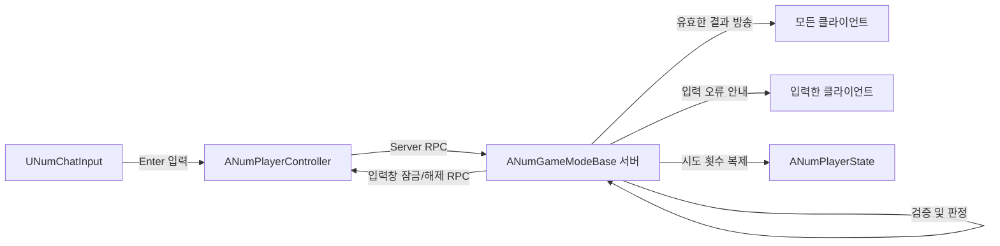

# NumberBaseballGame

Unreal Engine C++로 만든 멀티플레이 숫자 야구 게임입니다. 서버가 정답과 라운드를 관리하고, 플레이어의 입력을 검증한 뒤 결과를 클라이언트에 전달합니다.

이 문서는 코드가 어떤 순서로 동작하는지, 그리고 Unreal Engine 자료구조를 각 기능에 왜 사용하는지 설명합니다.

## 게임 규칙

- 정답과 입력은 `1`~`9` 중 중복 없이 고른 세 자리 숫자입니다.
- 숫자와 위치가 모두 맞으면 스트라이크, 숫자만 맞고 위치가 다르면 볼, 일치하는 숫자가 없으면 `OUT`입니다.
- 플레이어마다 라운드당 최대 세 번 추측할 수 있습니다.
- 입력 형식이 잘못됐거나 숫자가 반복되거나, 라운드에서 이미 제출한 추측이면 기회를 사용하지 않습니다.
- 잘못된 입력 안내는 입력한 플레이어에게만 보입니다. 유효한 추측 결과와 기회 소진 안내는 모든 플레이어에게 보입니다.
- 기회를 모두 사용한 플레이어는 입력창이 잠기고 서버도 입력을 거부합니다. 새 라운드가 시작되면 다시 입력할 수 있습니다.
- 정답은 화면에 표시하지 않고 서버의 `Warning` 로그에만 출력합니다.

## 코드 구성

| 클래스 | 파일 | 책임 |
|---|---|---|
| `ANumGameModeBase` | `Source/NumberBaseballGame/Game/NumGameModeBase.h/.cpp` | 서버의 정답, 입력 검증, 추측 기록, 판정, 횟수와 라운드 관리 |
| `ANumGameStateBase` | `Source/NumberBaseballGame/Game/NumGameStateBase.h/.cpp` | 접속 안내 멀티캐스트 |
| `ANumPlayerController` | `Source/NumberBaseballGame/Player/NumPlayerController.h/.cpp` | 클라이언트 입력을 서버에 보내고, 결과와 입력창 상태를 클라이언트에 전달 |
| `ANumPlayerState` | `Source/NumberBaseballGame/Player/NumPlayerState.h/.cpp` | 플레이어 이름과 현재/최대 시도 횟수 저장 및 복제 |
| `UNumChatInput` | `Source/NumberBaseballGame/UI/NumChatInput.h/.cpp` | UMG 입력창의 Enter 이벤트 처리, 입력창 잠금/해제 |
| `ANumPawn` | `Source/NumberBaseballGame/Player/NumPawn.h/.cpp` | 플레이어 Pawn |

## 게임 흐름



1. `UNumChatInput`이 Enter를 감지해 `SetChatMessageString`을 호출합니다.
2. `ANumPlayerController`가 `ServerRPCPrintChatMessageString`으로 입력을 서버에 보냅니다.
3. 서버의 `ANumGameModeBase::PrintChatMessageString`이 기회, 형식, 입력 안의 숫자 중복, 라운드 내 추측 중복 순서로 검사합니다.
4. 검사를 통과한 입력만 `SubmittedGuesses`에 기록하고 시도 횟수를 올립니다.
5. 서버가 스트라이크/볼을 계산해 모든 클라이언트에 알립니다.
6. 승리 또는 무승부면 서버가 라운드 상태를 초기화합니다.

## Unreal Engine 자료구조

| 자료구조/타입 | 코드에서 쓰는 곳 | 선택 이유 |
|---|---|---|
| `FString` | 정답, 입력, 결과 메시지 | 숫자 순서와 각 자리 문자를 그대로 다루기 좋습니다. |
| `TArray<int32>` | 정답 생성 후보 숫자 목록 | 후보를 순회하고, 뽑은 숫자를 `RemoveAt`으로 제거할 수 있습니다. |
| `TSet<FString>` | `SubmittedGuesses` | 라운드에서 같은 추측이 이미 나왔는지 `Contains`로 확인합니다. 새 라운드에서는 `Reset`으로 비웁니다. |
| `TArray<TObjectPtr<ANumPlayerController>>` | `AllPlayerControllers` | 접속 플레이어를 모아 알림을 보내거나 라운드를 초기화할 때 순회합니다. |
| `TObjectPtr<T>` | 위젯 인스턴스 참조 | Unreal UObject를 참조합니다. 위젯 인스턴스는 `UPROPERTY`와 함께 선언되어 엔진이 추적할 수 있습니다. |
| `TSubclassOf<T>` | 위젯 클래스 설정 | 에디터에서 지정하는 클래스가 예상한 부모 클래스의 하위 클래스인지 제한합니다. |

`TArray`는 순회할 목록에, `TSet`은 중복 여부를 확인할 데이터에 사용합니다. 정답 후보와 플레이어 목록은 배열로 관리하고, 라운드별 제출 기록은 집합으로 관리합니다.

## 단계별 구현

### 1. 정답 만들기: `TArray`와 `FString`

`GenerateSecretNumber`는 `1`~`9` 후보를 `TArray<int32>`에 넣고, 무작위로 하나를 골라 결과 문자열에 추가합니다. 고른 숫자는 배열에서 제거하므로 정답 안에 같은 숫자가 다시 들어가지 않습니다.

```cpp
FString ANumGameModeBase::GenerateSecretNumber()
{
	TArray<int32> CandidateDigits;
	for (int32 Digit = 1; Digit <= 9; ++Digit)
	{
		CandidateDigits.Add(Digit);
	}

	FString SecretNumber;
	for (int32 Place = 0; Place < 3; ++Place)
	{
		const int32 RandomIndex = FMath::RandRange(0, CandidateDigits.Num() - 1);
		SecretNumber.Append(FString::FromInt(CandidateDigits[RandomIndex]));
		CandidateDigits.RemoveAt(RandomIndex);
	}

	return SecretNumber;
}
```

정답은 `ANumGameModeBase`가 서버에서만 보관합니다. `BeginPlay`와 `ResetGame`에서 정답을 만들고 `UE_LOG(LogTemp, Warning, ...)`으로 서버 로그에 출력합니다. 정답을 클라이언트에 복제하거나 게임 화면에 보여주지는 않습니다.

### 2. 입력 유효성 검사

`IsGuessNumberString`은 입력이 세 자리인지, 각 문자가 `1`~`9`인지 확인합니다. 입력 안의 숫자 중복은 호출부에서 따로 검사해 구체적인 안내를 보냅니다.

```cpp
bool ANumGameModeBase::IsGuessNumberString(const FString& Guess)
{
	if (Guess.Len() != 3)
	{
		return false;
	}

	for (TCHAR Digit : Guess)
	{
		if (Digit < TEXT('1') || Digit > TEXT('9'))
		{
			return false;
		}
	}

	return true;
}
```

### 3. 제출 중복 확인: `TSet<FString>`

같은 숫자 조합을 라운드에서 다시 사용하지 못하게 `SubmittedGuesses`에 유효한 추측을 저장합니다. 집합에 이미 있으면 시도 횟수를 올리지 않고, 입력한 플레이어에게만 메시지를 보냅니다.

```cpp
if (SubmittedGuesses.Contains(Guess))
{
	const FString Message = PlayerState->GetPlayerInfoString()
		+ TEXT(": 이미 제출된 숫자입니다. 다시 입력하세요");
	InChattingPlayerController->ClientRPCPrintChatMessageString(Message);
	return;
}

SubmittedGuesses.Add(Guess);
IncreaseGuessCount(InChattingPlayerController);
```

입력 안에서 숫자가 반복되는 `112`와, 누군가 이미 제출한 `369`는 서로 다른 검사입니다. `112`는 입력의 세 자리를 서로 비교하고, 이미 제출된 `369`는 `TSet<FString>`에서 전체 문자열을 조회합니다.

### 4. 스트라이크와 볼 계산

입력 유효성 검사를 통과한 추측만 `JudgeResult`로 전달합니다. 같은 위치의 숫자가 같으면 스트라이크로 세고, 위치는 다르지만 정답에 포함된 숫자면 볼로 셉니다.

```cpp
FString ANumGameModeBase::JudgeResult(
	const FString& Secret,
	const FString& Guess)
{
	int32 Strikes = 0;
	int32 Balls = 0;

	for (int32 Place = 0; Place < 3; ++Place)
	{
		if (Secret[Place] == Guess[Place])
		{
			++Strikes;
		}
		else
		{
			const FString GuessDigit = FString::Printf(TEXT("%c"), Guess[Place]);
			if (Secret.Contains(GuessDigit))
			{
				++Balls;
			}
		}
	}

	if (Strikes == 0 && Balls == 0)
	{
		return TEXT("OUT");
	}

	return FString::Printf(TEXT("%dS%dB"), Strikes, Balls);
}
```

### 5. 기회와 라운드 관리

- 기회를 모두 썼는지 입력 형식 검사보다 먼저 확인합니다. 이후 입력은 거부하고 전체에 `기회를 모두 사용했습니다.`를 알립니다.
- 마지막 기회를 틀리면 `ClientRPCSetChatInputEnabled(false)`로 해당 플레이어의 입력창을 잠급니다. 서버도 시도 횟수를 확인하므로 UI를 우회해도 입력은 처리되지 않습니다.
- 3스트라이크면 해당 플레이어가 승리합니다. 모든 플레이어가 최대 횟수에 도달하면 무승부입니다.
- `ResetGame`은 새 정답을 만들고 `SubmittedGuesses.Reset()`으로 제출 기록을 비웁니다. 플레이어별 시도 횟수를 0으로 되돌리고 입력창 잠금을 해제합니다.

## 네트워크 역할

- **서버 전용:** `ANumGameModeBase`의 정답과 `SubmittedGuesses`는 서버에서만 관리합니다.
- **복제되는 플레이어 상태:** `ANumPlayerState`의 이름과 현재/최대 횟수는 `DOREPLIFETIME`으로 클라이언트에 복제됩니다.
- **클라이언트에서 서버로:** `ServerRPCPrintChatMessageString`으로 추측을 전달합니다.
- **서버에서 개인에게:** 잘못된 입력 안내와 입력창 상태 변경은 해당 플레이어의 Client RPC로 전달합니다.
- **서버에서 전체로:** 유효한 추측 결과와 기회 소진 안내는 각 플레이어 컨트롤러의 Client RPC를 통해 방송합니다.

