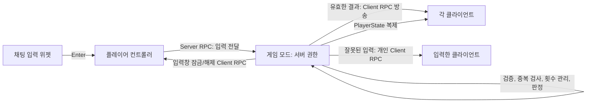

# NumberBaseballGame

Unreal Engine C++로 만든 멀티플레이 숫자 야구 게임입니다. 서버가 정답과 라운드 상태를 관리하고, 각 플레이어의 입력을 검증한 뒤 결과를 클라이언트에 전달합니다.

## 게임 규칙

- 정답은 `1`부터 `9`까지의 서로 다른 숫자 3개로 구성됩니다.
- 입력도 `1`부터 `9`까지의 서로 다른 숫자 3개여야 합니다.
- 숫자와 위치가 모두 맞으면 스트라이크, 숫자만 맞고 위치가 다르면 볼입니다. 일치하는 숫자가 없으면 `OUT`입니다.
- 한 플레이어는 라운드마다 최대 3번 시도합니다.
- 형식 오류, 입력 안의 숫자 중복, 라운드에서 이미 제출된 추측은 시도 횟수를 사용하지 않습니다.
- 입력 오류 안내는 입력한 플레이어에게만 보입니다. 유효한 추측 결과는 모든 플레이어에게 보입니다.
- 마지막 기회까지 정답을 맞히지 못하면 `기회를 모두 사용했습니다.`를 전체에 알리고 해당 플레이어의 입력창을 잠급니다. 서버도 추가 입력을 거부합니다.
- 누군가 정답을 맞히거나 모든 플레이어가 기회를 사용하면 라운드를 종료하고 새 정답과 시도 횟수로 초기화합니다. 입력창 잠금도 해제합니다.
- 정답은 게임 화면에 표시하지 않습니다. 라운드 시작 때 서버의 Unreal 로그에 `Warning` 등급으로 출력합니다.

## 구현 흐름



### 한 번의 추측 처리

1. `UNumChatInput`이 Enter 입력을 받으면 `ANumPlayerController::SetChatMessageString`을 호출합니다.
2. 플레이어 컨트롤러가 입력 문자열을 `ServerRPCPrintChatMessageString`으로 서버에 전달합니다.
3. 서버의 `ANumGameModeBase::PrintChatMessageString`이 다음 순서로 처리합니다.
   1. 플레이어의 시도 횟수가 한도에 도달했는지 확인합니다. 다 썼으면 다른 입력 검사보다 먼저 거절하고 전체에 안내합니다.
   2. 입력 길이가 3인지, 각 문자가 `1`~`9`인지 확인합니다.
   3. 입력 문자열 안에 같은 숫자가 있으면 입력한 플레이어에게 `중복되지 않은 숫자를 입력해주세요.`를 보내고 종료합니다.
   4. 같은 추측이 이번 라운드에 이미 제출됐는지 확인합니다. 이미 있으면 입력한 플레이어에게만 안내하고 종료합니다.
   5. 유효한 입력만 추측 기록과 시도 횟수에 반영하고 스트라이크/볼을 계산합니다.
   6. 결과를 전체 클라이언트에 전달한 뒤 승리 또는 무승부 여부를 확인합니다.
4. 시도 횟수를 모두 사용한 플레이어는 클라이언트 입력창도 잠깁니다. 새 라운드가 시작될 때 다시 열립니다.

## 클래스와 파일

| 클래스 | 파일 | 역할 |
|---|---|---|
| `ANumGameModeBase` | `Source/NumberBaseballGame/Game/NumGameModeBase.h/.cpp` | 서버에서 정답 생성, 입력 검증, 중복 추측 기록, 판정, 시도 횟수 및 라운드 관리 |
| `ANumGameStateBase` | `Source/NumberBaseballGame/Game/NumGameStateBase.h/.cpp` | 접속 안내를 멀티캐스트 RPC로 전달 |
| `ANumPlayerController` | `Source/NumberBaseballGame/Player/NumPlayerController.h/.cpp` | 클라이언트 입력을 서버 RPC로 전달하고, 결과와 입력창 잠금 상태를 클라이언트에 전달 |
| `ANumPlayerState` | `Source/NumberBaseballGame/Player/NumPlayerState.h/.cpp` | 플레이어 이름과 현재/최대 시도 횟수를 저장하고 복제 |
| `UNumChatInput` | `Source/NumberBaseballGame/UI/NumChatInput.h/.cpp` | UMG 입력창에서 Enter 입력을 받고 활성화/비활성화 |
| `ANumPawn` | `Source/NumberBaseballGame/Player/NumPawn.h/.cpp` | 플레이어 Pawn 타입 |

## Unreal 자료구조와 타입

| 타입 | 사용 위치 | 사용하는 이유 |
|---|---|---|
| `FString` | 정답, 입력, 채팅 결과 | 숫자의 순서가 중요하므로 정수 하나로 변환하지 않고 문자열로 보관합니다. 각 자리 비교와 `S/B` 출력도 간단합니다. |
| `TArray<int32>` | `GenerateSecretNumber`의 후보 숫자 목록 | 후보 `1`~`9`를 순서대로 보관하고, 하나를 뽑을 때마다 `RemoveAt`으로 제거해 정답 내 숫자 중복을 방지합니다. |
| `TSet<FString>` | `SubmittedGuesses` | 한 라운드에 이미 제출된 추측을 저장합니다. `Contains`로 동일한 전체 추측이 있었는지 확인하고, 라운드가 바뀌면 `Reset`합니다. |
| `TArray<TObjectPtr<ANumPlayerController>>` | `AllPlayerControllers` | 로그인한 플레이어 컨트롤러들을 모아 승리/무승부 알림과 라운드 초기화를 적용합니다. |
| `TObjectPtr<T>` | 플레이어 컨트롤러와 위젯 참조 | Unreal UObject를 가리키는 포인터 타입입니다. 위젯 클래스의 `TObjectPtr` 프로퍼티는 `UPROPERTY`로 선언해 Unreal 객체 참조로 관리합니다. |
| `TSubclassOf<T>` | `ChatInputWidgetClass`, `NotificationTextWidgetClass` | 에디터에서 지정할 위젯 클래스를 해당 부모 타입의 하위 클래스로 제한합니다. |

`TArray`는 순서가 있거나 전체 목록을 순회할 때, `TSet`은 중복 확인이 목적일 때 사용합니다. 이 프로젝트에서는 후보 숫자와 접속 플레이어는 배열로, 라운드 중 이미 사용한 추측은 집합으로 표현합니다.

## 주요 코드 흐름

### 정답 생성

`ANumGameModeBase::GenerateSecretNumber`는 후보 배열을 만들고, 무작위 인덱스의 숫자를 결과 문자열에 추가한 뒤 후보에서 제거합니다. 3번 반복하므로 정답은 세 자리이며 서로 다른 숫자로 구성됩니다.

```cpp
TArray<int32> Numbers;
for (int32 Number = 1; Number <= 9; ++Number)
{
	Numbers.Add(Number);
}

FString Result;
for (int32 Index = 0; Index < 3; ++Index)
{
	const int32 PickedIndex = FMath::RandRange(0, Numbers.Num() - 1);
	Result.Append(FString::FromInt(Numbers[PickedIndex]));
	Numbers.RemoveAt(PickedIndex);
}
```

정답 문자열은 `ANumGameModeBase`에만 두고 클라이언트로 복제하지 않습니다. 서버 `Warning` 로그는 개발/운영자가 라운드 정답을 확인하기 위한 것으로, 사용자 게임 화면에는 출력되지 않습니다.

### 입력 검증과 중복 관리

입력 검증은 서버에서 실행합니다. UI에서 입력을 막더라도 서버는 시도 횟수 제한을 다시 검사하므로, 클라이언트에서 직접 RPC를 호출해도 횟수를 초과할 수 없습니다.

```cpp
if (PlayerState->CurrentGuessCount >= PlayerState->MaxGuessCount)
{
	// 이 검사를 형식/중복 검사보다 먼저 적용
	return;
}

if (!IsGuessNumberString(InChatMessageString))
{
	// 정확히 세 자리이며 각 문자가 1~9인지 확인
	return;
}

if (InChatMessageString[0] == InChatMessageString[1]
	|| InChatMessageString[0] == InChatMessageString[2]
	|| InChatMessageString[1] == InChatMessageString[2])
{
	// 같은 입력 안에 숫자가 반복되면 기회를 사용하지 않음
	return;
}

if (SubmittedGuesses.Contains(InChatMessageString))
{
	// 다른 플레이어가 이미 제출한 전체 추측도 기회를 사용하지 않음
	return;
}

SubmittedGuesses.Add(InChatMessageString);
IncreaseGuessCount(InChattingPlayerController);
```

입력 순서가 중요합니다. 시도 횟수가 이미 소진된 플레이어는 중복 숫자를 입력하더라도 먼저 `기회를 모두 사용했습니다.`로 처리됩니다. 그 외 잘못된 입력은 개인 메시지로 안내하며 횟수를 증가시키지 않습니다.

### 판정

`JudgeResult`는 같은 인덱스의 문자를 비교해 스트라이크를 세고, 위치가 다른 문자가 정답 문자열에 포함되어 있는지 확인해 볼을 셉니다. 유효한 추측만 이 함수에 전달되므로 각 인덱스 접근은 항상 세 자리 범위 안에 있습니다.

### 라운드 종료와 입력 잠금

- 3스트라이크면 해당 플레이어가 승리하고 새 라운드로 이동합니다.
- 모든 플레이어의 `CurrentGuessCount`가 `MaxGuessCount`에 도달하면 무승부로 처리합니다.
- 마지막 기회를 틀린 플레이어는 `ClientRPCSetChatInputEnabled(false)`로 입력창이 잠기고, 전체에 시도 소진 안내가 전달됩니다.
- `ResetGame`은 새 정답을 만들고 `SubmittedGuesses`를 비우며 모든 플레이어의 횟수를 0으로 되돌리고 입력창을 다시 엽니다.

## 네트워크 책임

- **서버 전용 상태:** 정답과 라운드별 추측 집합은 `ANumGameModeBase`가 관리합니다. 이 상태는 클라이언트에 복제하지 않습니다.
- **플레이어별 복제 상태:** `ANumPlayerState`의 이름, 현재 횟수, 최대 횟수는 `DOREPLIFETIME`으로 복제합니다.
- **클라이언트 → 서버:** `ServerRPCPrintChatMessageString`이 입력을 서버에 전달합니다.
- **서버 → 한 클라이언트:** 잘못된 입력/중복 입력 안내와 입력창 잠금은 입력을 보낸 플레이어의 Client RPC로 전달합니다.
- **서버 → 모든 클라이언트:** 유효한 추측 결과와 시도 소진 안내는 각 플레이어 컨트롤러의 Client RPC를 통해 방송합니다.

## 프로젝트 구성

- Unreal 프로젝트: `NumberBaseballGame.uproject`
- C++ 모듈: `Source/NumberBaseballGame`
- UMG 위젯 클래스는 에디터에서 `ANumPlayerController`의 `ChatInputWidgetClass`와 `NotificationTextWidgetClass`에 지정합니다.
- 모듈 의존성은 `NumberBaseballGame.Build.cs`에 정의되어 있으며, UMG와 Slate 모듈을 포함합니다.
